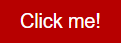
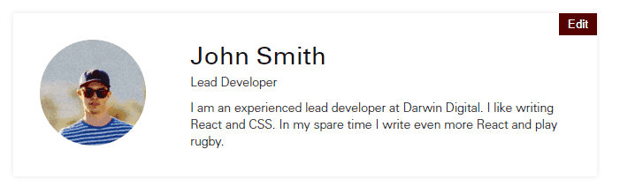

# Installation

Type `yarn install` on the command line and let it install. If you do not have yarn then `npm install` will work.
[Yarn is better](https://www.sitepoint.com/yarn-vs-npm/) but either is fine.

You can download Yarn from [https://yarnpkg.com](https://yarnpkg.com).

# What is bloc?

Bloc is a system designed by [Darwin Digital](http://darwindigital.co) which enables and facilitates rapid front-end
development. Bloc doesn't care what your back end is written with as it controls only the front end. It can be dropped
in to any project and will work.

It includes the following tools to improve the developer experience.

## Browsersync
  - A tool that will stream any CSS changes straight to your browser without the need for a reload. We have set it up
  to enable react components to be hot reloaded.
  - You can access the website from another device on the network by navigating to the URL shown by browsersync when it
  starts up. This is useful for testing on mobile devices and seeing your code changes in realtime.
  [Visit the browsersync website](https://browsersync.io/) 
  
## Babel
  - Babel transpiles your [ECMAScript 6](http://es6-features.org/#Constants) code into ES5 code that can be executed by
  all browsers.
  - ES6 is a new JavaScript standard that introduces a lot of new syntax which helps you write more readable and concise
  JavaScript.
  
## Chai & Mocha
  - [Chai](http://www.chaijs.com/) is an assertion library for Node which allows you to test your JavaScript. [Mocha](https://github.com/mochajs/mocha) is a 
  test runner for Node.
  
## CSStyle
  - [CSStyle](https://github.com/csstyle/csstyle) is a collection of mixins used to produce BEM compliant CSS selectors
  in Sass.

## ESlint
  - [ESLint](https://eslint.org/) is a JavaScript linter. It will flag up code that does not adhere to the agreed style
  guide. It will flag up issues with code that make it more difficult to read, or are questionable practices.
  
## Gulp
  - Gulp is a task runner. We are aware that using gulp in parallel with webpack is not best-practice but until a better
  solution is presented for our use-cases, this is the best way we can present an easy development process and eliminate
  repetitive tasks. As new solutions relating to webpack, Sass and globbing become available we will review the possibility
  of removing gulp from bloc.
  - in bloc, gulp is used to lint the project's Sass files before it compiles them into a single CSS file. It also runs
  browsersync and facilitates the streaming of new CSS to the browser.
  
## Immutable.js
  - Written by Facebook, [Immutable.js](https://facebook.github.io/immutable-js/docs/#/) offers a collection of
  immutable data types. We use this when writing complex react
  components to stop data being changed.
  
## React
  - [React](https://reactjs.org/) makes component-based development easy. It encourages developers to separate concerns
  and build systems in a modular and easy to read way. Like bloc, react doesn't care what your back end is built in as it
  is a purely front-end technology. It is backed by Facebook which means immense effort goes into the development of it
  as their commercial interests depend on react being the best tool for producing fast front ends with a low development
  overhead.
  
## Redux
  - Redux is a library used for managing the state of an application. It works well with React through the `react-redux` 
  package and using it in tandem with Immutable.js produces an immutable state tree. By using redux to manage your
  application's state, you can time-travel back and forward through varying states of your app. This makes debugging and
  testing easier.
  
## Webpack
  - Webpack and babel work together to produce a single bundle file that has the entire JavaScript code for your site
  contained within. This is better than having several small bundles as the overhead of HTTP connection setup and teardown
  incurred is avoided. Again, we understand using this _with_ gulp is not best practice but in the interests of efficiency
  from a development perspective this is the best way we have found.

# Usage

## Creating a component using static markup

At the most basic level, each component should have its own file for: Markup, CSS and Javascript (if necessary).
These files can be split up further to improve readability and separation of concerns if necessary, but two components
should never be in one file.

In BEM, parts of the webpage are described as "blocks" and "elements" which can have "modifiers", hence BEM.

Using CSStyle the nomenclature is slightly different. We describe the root-level element as the "component" and elements
within this that are directly related to the component are called "parts". Any modifications to these parts are described
as "options". 

An example button component is below

`button.html - Markup`
```html
<a class="button">Click me!</a>
```

`./assets/styles/scss/components/_button.scss - Sass` 
```css
@include component(button) {
  display: inline-block;
  padding: 10px 20px;
  font-size: 1.4rem;
  background: $palette_b;
  color: $white;
}
```
The above code after being processed and compiled results in the following component:



## Adding parts to a component 

The button was just a component with nothing inside it, but let's add an icon to the button now. The icon is not a root-level
component and is a part of the button component so we will describe it as such. We will add the icon by using a background
image.

`button.html - Markup`
```html
<a class="button">Click me! <span class="button__icon"></span></a>
```

`./assets/styles/scss/components/_button.scss - Sass` 
```css
@include component(button) {
  display: inline-block;
  padding: 10px 20px;
  font-size: 1.4rem;
  background: $palette_b;
  color: $white;
  border: 0;

  @include part(icon) {
    height: 20px;
    width: 20px;
    background: url('/assets/img/icons/rocket-ship.png') no-repeat center;
    background-size: contain;
    display: inline-block;
    margin-left: 15px;
  }
}
```

The above code after being processed and compiled results in the following component:


## Adding options to parts of a component 

The button with the icon had the background hard-coded to be a rocket ship, but what if we had several different icons to
show for different scenarios? We would need to use an option to dictate different states for a part to have.

`button.html - Markup`
```html
<a class="button">Click me! <span class="button__icon --rocket"></span></a>

<a class="button">Click me! <span class="button__icon --spanner"></span></a>
```

`./assets/styles/scss/components/_button.scss - Sass` 
```css
@include component(button) {
  display: inline-block;
  padding: 10px 20px;
  font-size: 1.4rem;
  background: $palette_b;
  color: $white;
  border: 0;

  @include part(icon) {
    height: 20px;
    width: 20px;
    background-size: contain;
    display: inline-block;
    margin-left: 15px;

    @include option(rocket) {
      background: url('/assets/img/icons/rocket-ship.png') no-repeat center;
    }
    
    @include option(spanner) {
      background: url('/assets/img/icons/spanner.png') no-repeat center;
    }
  }
}
```

The above code after being processed and compiled results in the following components:


## Creating a react component

To create a react component you should create the following file: `./assets/js/react/{ComponentName}/{ComponentName.jsx}`

We will use ES6 classes to make our components. Careful consideration should be made to ensure all concerns are separated.

In this example we will make an part of a profile page for a user of the system. It will allow the user to edit their name.

The first step to take is to create a mount point for the component. In `./components/userprofile.html` we have added the
followig markup.

```html
<div id="user-profile__react-anchor"></div>
```

Now we create the ES6 class that represents our React component. We give the root element that is returned by the component
a class that is the same as the filename, but hyphenated instead of camelcased.

```js
import React from 'react';

export default class UserProfile extends React.Component {

  constructor(props) {
    super();
    this.state = {...props, name: 'John Smith', editingName: false};
  }

  render() {
    return (
      <section className={'user-profile'}>
        <div className={'user-profile__image-container'}>
          <div className={'user-profile__image'}></div>
        </div>

        <div className={'user-profile__content-container'}>
          <div className={'user-profile__name'}>

            {this.state.editingName ? <input value={this.state.name} onChange={e => this.setState({name: e.target.value})} type={'text'} /> : this.state.name}

            <button className={'user-profile__edit-button'} onClick={() => this.setState({editingName: !this.state.editingName})}>{this.state.editingName ? 'Save' : 'Edit'}</button>
          </div>
          <div className={'user-profile__job-title'}>Lead Developer</div>
          <div className={'user-profile__description'}>I am an experienced lead developer at Darwin Digital. I like
            writing React
            and CSS. In my spare time I write even more React and play rugby.
          </div>
        </div>
      </section>
    );
  }
}
```

As you can see, every HTML element has a class written to adhere to the BEM methodology. That way we can use the CSStyle
mixins to create our easy to read stylesheet. The stylesheet is located at `./assets/styles/scss/components/_user-profile.scss`
and contains _only_ the styling for this component and nothing else.

```css
@include component(user-profile) {
  @extend .cf;
  padding: 30px;
  box-shadow: 0 0 7px $grey-1;
  display: inline-block;
  margin-top: 30px;
  margin-left: 30px;
  width: 600px;
  position: relative;

  @include part(edit-button) {
    position: absolute;
    padding: 5px 10px;
    background: $palette_a;
    border: 0;
    cursor: pointer;
    color: $white;
    top: 0;
    right: 0;
  }

  @include part(name) {
    font-family: $boldfont;
    font-size: 2rem;
  }

  @include part(image-container) {
    width: 25.33%;
    margin-right: 3%;
    display: inline-block;
    float: left;
  }

  @include part(content-container) {
    width: 71%;
    display: inline-block;
    float: left;
  }

  @include part(job-title) {
    margin-bottom: 10px;
  }

  @include part(image) {
    display: inline-block;
    height: 120px;
    width: 120px;
    background: url('/assets/img/profile.png') no-repeat center;
    background-size: cover;
    border-radius: 60px;
    margin-right: 20px;
  }
}
``` 

We now need to loop through all of the potential react apps to add to a page, see if their anchor is present and if it is:
mount the component there. We do this in `./assets/js/src/react/index.jsx`. We add the mount point as a member of an object
called `elements` and then check if the element exists. If it does we should add it to an array of apps, along with the
mount point and the actual React component.

```js
const elements = {
  userProfile: document.getElementById('user-profile__react-anchor')
};

let apps = [];

if (elements.userProfile) {
  apps.push({
    element: elements.userProfile,
    component: <UserProfile/>,
    file: './UserProfile/UserProfile',
    name: 'UserProfile'
  });
}
```



# Running the project

- Edit your gulpfile, set `appUrl` to be the URL of the site you're working on. This is what browsersync will proxy to.
If you're just using the `index.html` file that comes with this, then leave it as it is.

- On the command line type `yarn run gulp` (from the root of this project) or if you've got gulp installed globally just type `gulp`.

- Connect to `http://localhost:3000` and marvel at the react hot module reloading and the css injection.
